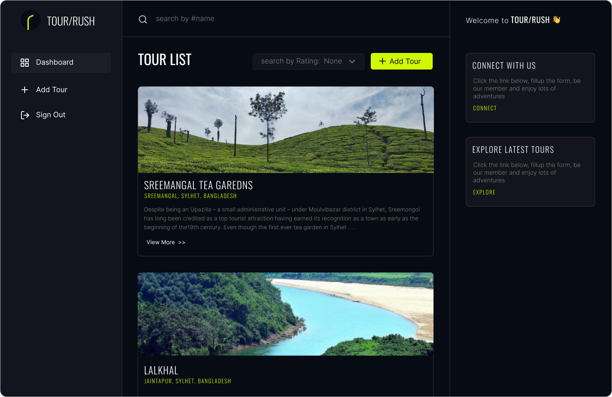

## TOUR/RUSH

    

Tour rush is simple crud (create, read, delete) application made with asp .net code MVC (Model View Controller). This application contains only the basic features (crud) that deal with only Tours. A sign in system is given but the sign up functionality is not included in this application.

## Features
1. Sign In & Signout
2. Control user flow (using session).
3. Create new tour.
4. Update existing tour information.
5. Delete tour.
6. Both client & server side validations.
7. Search a tour by its name.

## Tools
ASP .NET MVC core v6